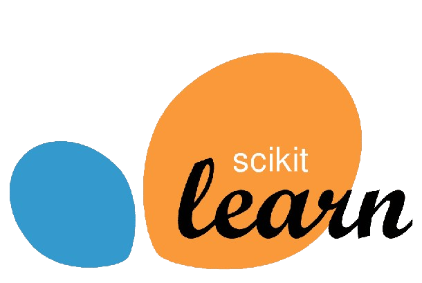

# 📲Advertisment Clicked on Predictions

This project analyze the different parameter and based upon those parameter predict where someone would click on a particular ad or not.

## 📘 Introduction

This is a Data Science, Data Visulization and Machine Learning Project that provided prediction based upon the given data set

## 📊 Data

The datset include different information of customers like

- Age
- Time Spent on Site
- Daily Internet Usage
  etc

## 🛠️ Installation

To run this project, you need to have Python installed along with the following libraries:

- **pandas** 🐼
- **numpy** 🔢
- **matplotlib**
- **seaborn**
- **plotly**
- **scikit-learn**

You can install the required libraries using pip:

```bash
pip install pandas numpy matplotlib seaborn plotly scikit-learn
```

<div align="center">

<span>
  
  
  
  
  
  
  
  
</span>

</div>

## 📈 Results

- The project involves the following steps:

## 📊 Data Visualization:

To visualize data distribution and relationships

- **matplotlib**
- **seaborn**
- **plotly**

## 🧠 Model Building:

- Training various classification models
- Evaluating model performance
- The results are displayed within the Jupyter Notebook or the Python script.
