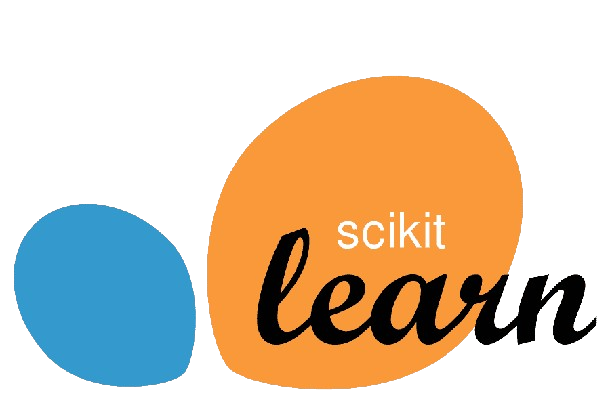

# 🧠 Custom ResNetSmall - CIFAR-10 Image Classification

A lightweight **ResNet-inspired** convolutional neural network built from scratch in **TensorFlow/Keras** to classify images from the **CIFAR-10** dataset.
This model integrates **residual identity blocks**, **data augmentation**, and **dropout regularization** to achieve strong performance while remaining efficient for training on modest hardware.

---

## 📂 Project Overview

This project demonstrates how to implement a **custom ResNet architecture** without using pre-built ResNet from libraries.
Key features include:

- **Residual Identity Blocks** to improve gradient flow and prevent vanishing gradients.
- **Data Augmentation** for robustness.
- **Batch Normalization** to speed up convergence.
- **Dropout** to reduce overfitting.

---

## 📊 Dataset

We use the **CIFAR-10** dataset, containing:

- **50,000 training images**
- **10,000 test images**
- **10 classes**: Airplane, Automobile, Bird, Cat, Deer, Dog, Frog, Horse, Ship, Truck

---

## 🏗 Model Architecture

```text
Input (32x32x3)
│
├── Data Augmentation (RandomFlip, RandomRotation)
├── Conv2D(64) + ReLU
├── IdentityBlock(64)
├── IdentityBlock(64)
├── Conv2D(128) + ReLU
├── IdentityBlock(128)
├── IdentityBlock(128)
├── GlobalAveragePooling2D
├── Dropout(0.5)
└── Dense(10, Softmax)
```

**Residual Identity Block Structure:**

```text
Input → Conv2D → BatchNorm → ReLU → Conv2D → BatchNorm → Add(Input) → ReLU
```

---

## ⚙ Installation & Usage

### 1️⃣ Install dependencies

```bash
pip install tensorflow numpy matplotlib scikit-learn
```

<div align="center">

<span>
    
    
    
    
  
   
    
  </span>
</span>

</div>

## 📌 Key Learnings

- Implementing **residual connections** from scratch improves model stability.
- **Data augmentation** greatly reduces overfitting in small datasets.
- A **lightweight ResNet** can still achieve competitive accuracy without going very deep.

---

If you’d like, I can also create **the actual architecture diagram and training/validation plots** so you can drop them straight into this README for GitHub. That way it looks fully polished.
Do you want me to prepare those?
