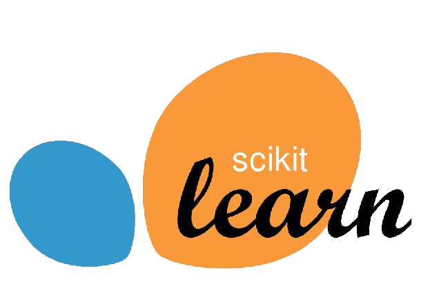

# Ecommerce Company

## Project Overview

This project aims to analyze a dataset to determine whether a company should focus on improving their mobile experience 📱 or their website experience.💻 The analysis is performed using Python, with scikit-learn for modeling, pandas and numpy for data manipulation and analysis, and seaborn and matplotlib for visualization.

## Installation

To run this project, you will need Python 3.x installed along with the following packages:

- pandas
- numpy
- scikit-learn
- seaborn
- matplotlib

<div align="center">

<span>
  
  
  
  
  
  
  
  
</span>

</div>

You can install these packages using pip:

```bash
pip install pandas numpy scikit-learn seaborn matplotlib

```

## Features

**The key features in the dataset include:**

**Average Session Length**:📊

- Various metrics related to mobile user experience.

**Time on App**: ⏰

- Various metrics related to website user experience

**Time in Store:**🛒

- The outcome metric we aim to predict (e.g., user satisfaction, sales, etc.)

## Modeling

The modeling process involves the following steps:

**Data Preprocessing:**🧹

- Cleaning and preparing the data for analysis.

**Exploratory Data Analysis (EDA):** 🔍

- Understanding the data distribution and relationships between variables.

**Feature Selection:**🎯

- Identifying the most relevant features for the model.

**Model Training:** 🤖

- Using scikit-learn to train a linear regression model.

**Model Evaluation:** 📈

- Assessing the performance of the model using appropriate metrics.

## Visualization

Visualizations are created using seaborn and matplotlib to understand the data better and to communicate the findings. Key visualizations include:

- Correlation heatmaps 🌡️
- Pair plots🔄
- Regression plots📉
- Residual plots 🗒️

## Results

The results of the linear regression model will help determine whether the company should focus on improving the mobile experience or the website experience. The key metrics used for evaluation include:

- Mean Absolute Error (MAE)📏
- Mean Squared Error (MSE)🧮
- R-squared (R²) score🅾️

## Conclusion:

The conclusion is that the company should focus on **Length of Membership ⏳**
