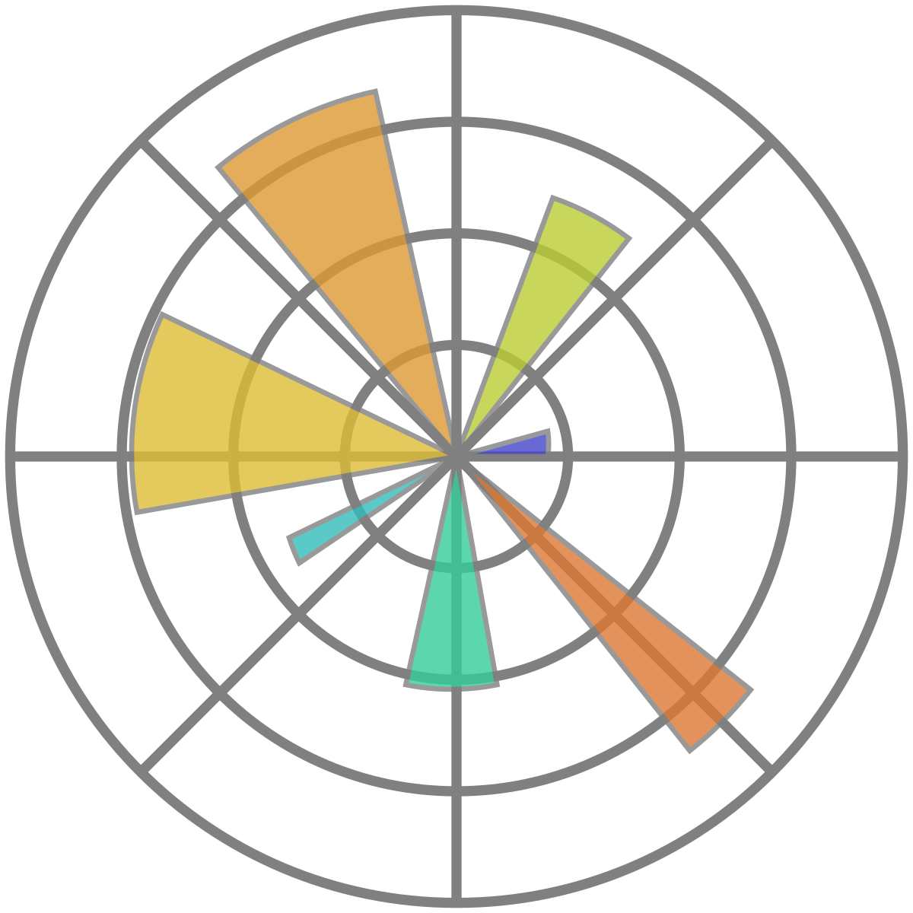

# 🎓 Machine Learning Projects 🤖

Welcome to the **Machine Learning Projects** repository! This repository contains various projects showcasing different machine learning algorithms implemented in Python. Each project is designed to illustrate a specific algorithm or concept in machine learning, complete with detailed explanations, code, and visualizations.

## 📋 Table of Contents

- [Projects](#projects)
- [Dependencies](#dependencies)
- [Installation](#installation)
- [Contributing](#contributing)
- [License](#license)

## 💻 Projects

1. **📈 Ecommerce Company Data**

   - In this project, we analyze the data for the ecommerce website and predict how to maximize the profits.
   - **Tech Used:** Pandas, Numpy, Matplotlib, Seaborn, Plotly, Scikit-learn
   - **Model Used:** Linear Regression

2. **🚢 Titanic Survival Prediction**

   - In this project, we predict whether someone would survive the Titanic disaster based on given parameters.
   - **Tech Used:** Pandas, Numpy, Matplotlib, Seaborn, Plotly, Scikit-learn
   - **Model Used:** Logistic Regression

3. **📰 Ads Clicked On Prediction**
   - We analyze whether someone would click on the ad based on the given information.
   - **Tech Used:** Pandas, Numpy, Matplotlib, Seaborn, Plotly, Scikit-learn
   - **Model Used:** Logistic Regression

## 📦 Dependencies

- Python 3.x
- Pandas
- Numpy
- Matplotlib
- Seaborn
- Plotly
- Scikit-Learn

```sh
pip install pandas numpy matplotlib plotly seaborn scikit-learn

```

<div align="center">

<span>
  
  
  
  
  
  
  
  
</span>

</div>

## ⚙️ Installation

#### 📥 Clone the Repository

```
git clone https://github.com/ahmedyar7/Machine-Learning-Projects.git
```

#### 📂 Navigate the Folder & Project file

## 🤝 Contributing

Contributions are what make the open source community such an amazing place to learn, inspire, and create. Any contributions you make are greatly appreciated.

- Fork the Project
- Create your Feature Branch (`git checkout -b feature/AmazingFeature`)
- Commit your Changes (`git commit -m 'Add some AmazingFeature'`)
- Push to the Branch (`git push origin feature/AmazingFeature`)
- Open a Pull Request

## 📜 License

Distributed under the MIT License. See [LICENSE](LICENSE) for more information.
